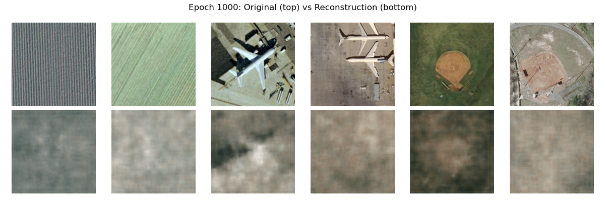

# Hierarchical Variational Autoencoder (HVAE)

This repository contains the implementation of a **Hierarchical Variational Autoencoder (HVAE)** trained on the [UC Merced Land Use Dataset](https://www.cs.ucmerced.edu/~gert/landuse.html). The goal is to learn a latent representation of satellite images using a deep generative model.
The full code is in [this file](Assign_5.py)

> **Note:** The current results are not very promising due to limited tuning and training time.
---

## Dataset

- **Dataset:** UC Merced Land Use
- **Images:** 2100 images (256x256 RGB)
- **Categories:** 21 land use classes (100 images each)
- **Format:** .tif images

---

## Training Curves:

## Results:

# Alternate implementation

Another implementation involving skip connections and resizing the images to 128*128 has been made, which showed better results than before. The program is in [the python file](Assign_5_alternate.py)

Also, you can run [this file](each_class_gen.ipynb) to see 6 reconstructed images for all 21 categories.

## Results

